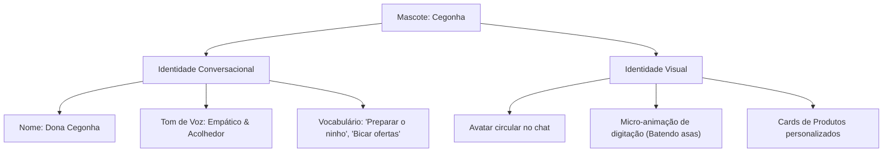

# Proposta de Design de UX: O Assistente Cegonha

Este documento apresenta alternativas e ideias de design de experiência do usuário (UX) para a personificação do assistente de compras inteligente com o tema da **Cegonha** e formas de torná-lo mais acessível aos usuários no frontend do **Fraldinha Livre**.

---

## 🐣 1. A Persona "Dona Cegonha"

A Cegonha já faz parte da marca Fraldinha Livre (logo no cabeçalho). O assistente inteligente de IA é a oportunidade perfeita para dar vida a essa persona.



### Detalhes do Tom de Voz
* **Empatia Mútua**: Conversar de forma simplificada, reconhecendo a correria ou exaustão de pais de recém-nascidos.
* **Agilidade Conversacional**: O assistente deve manter as perguntas simples, fazendo apenas uma pergunta de cada vez para facilitar as respostas por dispositivos móveis.

---

## 🗺️ 2. Pontos de Acesso na Interface (Discoverability)

Como a rota `/assistente` está atualmente desvinculada de links nas páginas públicas e privadas, propomos os seguintes pontos de acesso:

### Opção 1: Link no Header (Navegação Superior)
* **Como funciona**: Adicionar na barra superior do `Header.tsx` um item como `✨ Assistente Inteligente` ou `💬 Falar com a Cegonha`.
* **Animação**: Um efeito pulsante sutil no texto ou ícone para atrair a atenção do usuário de forma não intrusiva.

### Opção 2: Card na Home Page (Hero / Landing Page)
* **Como funciona**: Inserir na página principal um card interativo ou seção de destaque apresentando o assistente.
* **Exemplo de texto**: *"Fraldas em promoção? Tamanho ideal? Peça ajuda para a nossa Cegonha Inteligente no chat!"* com um botão CTA `Falar com a Cegonha`.

### Opção 3: Banner no Painel do Comprador (Minha Conta)
* **Como funciona**: Quando o comprador entra em `/minha-conta`, exibe-se um banner de reabastecimento inteligente: *"Dona Cegonha está a postos! Quer reabastecer seu estoque rápido? [Abrir Assistente]"*.

### Opção 4: Widget Flutuante (Floating Chat Bubble)
* **Como funciona**: Um pequeno balão redondo fixado no canto inferior direito de todas as telas (ou apenas na página de catálogo `/catalogo`).
* **Visual**: O rostinho da cegonha com uma notificação sutil. Ao clicar, abre o chat em uma aba flutuante ou direciona para `/assistente`.

---

## 💬 3. Fluxo Conversacional e UI do Chat

Para tornar o chat mais intuitivo, podemos projetar os seguintes componentes visuais:

### Respostas Rápidas (Quick Replies)
No início da conversa, exibir botões rápidos para que o usuário não precise digitar tudo:
```
[ 🔎 Fraldas Huggies M ]   [ 🤑 Ver Promoções ]   [ 🍼 Guia de Tamanhos ]
```

### Cards Ricos de Produto
Em vez do assistente responder com listas de texto brutos, exibir um componente visual limpo no balão de chat:
```
+---------------------------------------------------+
|  [FOTO DA FRALDA]                                 |
|  Pampers Supersec Pants - Tamanho M (32 tiras)    |
|  R$ 22,00 (Fornecedor: Super Fraldas)             |
|                                                   |
|  [ Colocar na Sacola ]                            |
+---------------------------------------------------+
```

### Checkout Suave (Sem Redirecionamento Brusco)
* **Antes**: O assistente adicionava o item no carrinho e redirecionava imediatamente para `/checkout`.
* **Depois (Melhoria)**: O assistente mantém o usuário no chat e exibe um link: *"Adicionei 2 pacotes de Pampers M na sua sacola! Quer continuar conversando ou deseja ir para o checkout? [Ir para o Pagamento]"*.

---

## 💡 Próxima Etapa para Estudo

Antes de codificar, analise a proposta e compartilhe sua opinião sobre:
1. **Onde você gostaria de ver o link de acesso ao assistente?** (Ex: Apenas no Header, como widget flutuante, ou em múltiplos lugares?)
2. **Qual nível de "tematização" (lúdico) você prefere para o tom de voz da Cegonha?**
   * *Nível Alto*: Uso constante de analogias (ex: "ninho", "bicar", "voar").
   * *Nível Moderado*: Saudação temática e avatar da cegonha, mas conversação focada e profissional nos produtos.
3. **Gostaria que o assistente abrisse em uma tela cheia dedicada (`/assistente`) ou como um popup/widget flutuante do lado inferior direito em todas as telas?**
