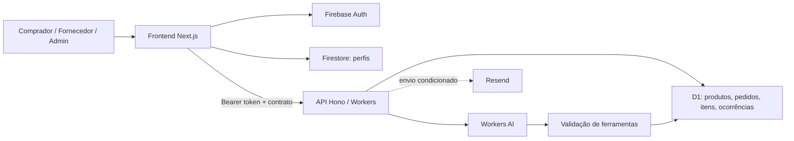

# PRD — Fraldinha Livre

**Versão:** 1.0 — documento para revisão do responsável pelo produto  
**Data:** 19 de setembro de 2026  
**Responsável pelas decisões:** Romário  
**Objetivo deste artefato:** consolidar o produto, seus requisitos, limites atuais e próximos marcos para discussão e revisão nesta colaboração. Não substitui decisões arquiteturais, specs aprovadas ou o harness existente.

## 1. Resumo executivo

Fraldinha Livre é um marketplace B2B2C de fraldas e itens relacionados. Conecta famílias e compradores recorrentes ou institucionais — como creches, clínicas e hospitais — a fornecedores. A primeira fase concentra-se em catálogo, compra direta, identidade, perfis, pedidos e operação do fornecedor. A segunda prevê leilão reverso como serviço independente, consumido por API, após a validação do marketplace.

O produto já possui frontend Next.js, API em Cloudflare Workers, persistência comercial em D1 e integração de identidade/perfis com Firebase. Há um assistente de compra por texto e imagem que consulta o catálogo e encaminha o usuário ao checkout.

**Limite fundamental:** criação de pedido não significa pagamento recebido ou entrega contratada. O checkout consultado ainda instancia `MockPaymentGateway` e `MockFulfillmentService`. A plataforma deve ser tratada como operação em validação/beta até que os critérios comerciais e operacionais de lançamento sejam atendidos.

Este é o primeiro PRD consolidado desta colaboração. O repositório já contém documentação técnica, specs, decisões e registros de sessões anteriores.

## 2. Base de evidências e confiança

### 2.1 Escopo da investigação

Foi consultada a branch `main` do GitHub no commit `d5b0ec373045a75fd9b59ac9fb660f44c8b007db`, utilizando o plugin GitHub. Leituras subsequentes de arquivos foram fixadas nesse commit. A Cloudflare foi consultada por seu plugin, exclusivamente para inventário de recursos e metadados de implantação.

Após indisponibilidade inicial das ferramentas locais, a conferência confirmou `HEAD` e a referência local `origin/main` no mesmo commit consultado diretamente no GitHub; a contagem `HEAD..origin/main` foi zero. Não houve `git fetch`: a comparação remota usou o plugin GitHub. O diff de arquivos rastreados estava vazio. Havia diretórios não rastreados `.codex/`, `front/.claude/` e `docs/` (este último contém o PRD criado nesta sessão); eles não foram incorporados a commit. O scratchpad indicado pelo usuário foi lido, mas o estado dos containers locais não foi inspecionado.

O plugin Firebase disponível nesta sessão fornece skills, mas não disponibiliza ferramenta de consulta autenticada ao projeto. Foi consultada a skill `firebase-auth-basics`. A análise Firebase deriva da configuração e do código versionados, sem inspeção do console ou dos dados reais.

### 2.2 Convenções de status

| Status | Significado |
|---|---|
| Observado no código | Há implementação na revisão consultada; não implica teste executado nesta sessão |
| Registrado | Documentação ou backlog afirma a entrega; a afirmação mantém sua data e escopo |
| Confirmado remotamente | Metadado consultado diretamente no serviço nesta sessão |
| Parcial/simulado | Fluxo existe, mas alguma integração ou garantia não está concluída |
| Planejado | Escopo previsto, ainda não considerado entregue |
| Proposto | Requisito ou métrica deste PRD que precisa de decisão antes de implementação |

### 2.3 Constatações remotas

| Item | Evidência em 19/09/2026 |
|---|---|
| Repositório | `romariobc/fraldinha-livre`, branch padrão `main` |
| Pull requests abertos | Consulta retornou lista vazia; o registro de 18/09 que menciona PR aberto é histórico |
| Worker da API | `fraldinha-livre-backend`, modificado em 19/09/2026 às 00:50:02 UTC |
| Worker do frontend | `fraldinha-livre-frontend`, modificado em 19/09/2026 às 00:51:30 UTC |
| Implantação mais recente da API | Criada às 00:50:00 UTC; versão `17c9814e-543b-43a7-83d4-fa2a88ccc632`, distribuição de 100% |
| Banco D1 | `fraldinha-livre-db`, existência confirmada por inventário |
| Saúde funcional | Não testada nesta sessão; existência de Worker não demonstra funcionamento ponta a ponta |

Não foram consultados registros pessoais de usuários, pedidos ou conversas. O inventário D1 não foi usado para inferir schema, quantidade de produtos ou integridade dos dados.

## 3. Problema e proposta de valor

### Problema de produto

Compradores de fraldas precisam encontrar produtos adequados, comparar ofertas e repetir compras frequentes. Fornecedores precisam publicar catálogo e receber pedidos com informações consistentes. A proposta do marketplace é centralizar essa descoberta e coordenação, reduzindo a fragmentação entre catálogo, contato e acompanhamento.

Essa formulação deriva do posicionamento do repositório; não há, nesta investigação, pesquisa de mercado ou entrevistas que quantifiquem a dor.

### Proposta de valor

- **Comprador:** encontrar produtos por características, conhecer fornecedor e preço, montar uma sacola e acompanhar pedidos.
- **Fornecedor:** manter catálogo próprio, compartilhar vitrine exclusiva e consultar pedidos atribuídos ao seu negócio.
- **Administrador:** supervisionar usuários, produtos e pedidos sem assumir o papel comercial dos participantes.
- **Assistente:** facilitar descoberta por linguagem natural e imagem, reutilizando o checkout existente.
- **Evolução futura:** permitir concorrência entre fornecedores por solicitações de compra mediante leilão reverso.

## 4. Objetivos e não objetivos

### Objetivos

1. Validar o fluxo catálogo → sacola → checkout → pedido persistido → acompanhamento.
2. Garantir que identidade, autorização, preços, estoque e posse dos recursos sejam verificados no servidor.
3. Oferecer experiência utilizável em dispositivos móveis e desktop.
4. Permitir gestão de catálogo e visibilidade de pedidos por fornecedor.
5. Tornar erros compreensíveis ao usuário e rastreáveis pela equipe.
6. Preparar pagamento e logística reais sem confundir simulações com liquidação financeira.
7. Evoluir mediante o harness existente, mantendo segurança e previsibilidade do desenvolvimento.

### Fora do escopo desta entrega documental

Alterar código, harness, regras de acesso, banco, configuração, implantação, containers ou dados de produção. Também não estão autorizados por este PRD a ativação do leilão, escolha de gateway, mudança do modelo comercial, integração ERP ou execução de correções descobertas durante a análise.

### Não objetivos da primeira fase

Leilão reverso operacional, aplicativo nativo independente, disputas automatizadas, negociação em tempo real, marketplace com pagamento já liquidado sem gateway e integração completa com transportadoras/ERPs.

## 5. Pessoas, papéis e permissões

| Pessoa/papel | Necessidade principal | Acesso esperado |
|---|---|---|
| Visitante | Descobrir oferta e entender a plataforma | Catálogo e conteúdo público |
| Comprador familiar | Comprar produtos adequados e repetir compras | Perfil, sacola, checkout e próprios pedidos |
| Comprador institucional | Organizar compras recorrentes ou de maior volume | Capacidades atuais do comprador; fluxos corporativos adicionais ainda precisam de definição |
| Fornecedor | Publicar oferta e acompanhar sua operação | Próprio catálogo, perfil, pedidos associados e ocorrências |
| Administrador | Supervisionar a plataforma | Escopos administrativos globais; sem bypass comercial |

As decisões D-048 a D-050 adotam autorização por Firebase Custom Claims e separam os papéis. Administrador não é implicitamente comprador nem fornecedor. Claims contraditórias devem resultar em negação de acesso.

Existe exceção legada documentada em D-051 para `ADMIN_UID`. As regras Firestore consultadas ainda contêm exceção por UID para leitura administrativa. Não declarar que a migração para claims está integralmente concluída em todas as camadas. A remoção dessas exceções requer tarefa própria, não uma alteração do PRD.

## 6. Jornadas principais

### 6.1 Compra direta

1. Visitante acessa catálogo ou vitrine de um fornecedor.
2. Consulta produto, características, preço e quantidade.
3. Ao iniciar compra, autentica-se e completa os dados necessários.
4. Adiciona produtos à sacola, organizados por fornecedor.
5. Confere endereço e itens no checkout.
6. Confirma a operação; o frontend separa pedidos por fornecedor.
7. O backend valida identidade, papel, produtos, fornecedor, valores e estoque.
8. O pedido persistido aparece na área do comprador e no escopo do fornecedor.
9. O comprador consulta detalhes e pode cancelar enquanto o pedido está `aguardando`.

O passo visual de pagamento existe, mas a integração financeira atual é simulada. A criação de vários pedidos por fornecedor não deve ser confundida com uma transação única para toda a sacola.

### 6.2 Operação do fornecedor

1. Fornecedor autentica-se com papel apropriado.
2. Mantém seu perfil e catálogo.
3. Compartilha sua vitrine pública.
4. Consulta pedidos associados aos seus produtos.
5. Registra ocorrência relacionada a um pedido que lhe pertence.
6. Consulta indicadores e relatórios, considerando as limitações de dados descritas adiante.

### 6.3 Compra assistida

1. Usuário autenticado abre `/assistente`.
2. Envia texto ou imagem em formato aceito.
3. A API consulta Workers AI e ferramentas de busca/detalhe do catálogo.
4. A seleção de produto é encaminhada ao checkout existente.
5. O usuário revisa e confirma a operação pelo fluxo de compra.

A seleção feita pela IA não representa pagamento, pedido concluído ou concessão de autorização. A ferramenta `select_product_for_purchase` valida argumentos e prepara o encaminhamento; não persiste pedido diretamente.

### 6.4 Supervisão administrativa

Administrador acessa `/admin`, consulta usuários, pedidos e produtos. Operações futuras de moderação devem usar rotas administrativas explícitas e trilha formal de auditoria, conforme D-050. A existência de uma página administrativa não autoriza a operação como fornecedor.

## 7. Escopo funcional e critérios de aceite

Prioridades abaixo expressam importância para validação e lançamento, não uma nova ordem de execução aprovada. **P0:** integridade/fluxo essencial; **P1:** operação e qualidade; **P2:** expansão.

| ID | Requisito | Prioridade | Estado observado | Critério de aceite |
|---|---|---|---|---|
| RF-01 | Autenticação Google e e-mail/senha | P0 | Código Firebase presente | Login/logout funcionam; token inválido ou expirado é rejeitado; acesso direto a rota protegida não contorna autenticação |
| RF-02 | Onboarding e papel | P0 | Implementação e decisões presentes | Papel autorizado é provisionado no servidor; cliente não consegue obter admin por payload ou edição de perfil |
| RF-03 | Perfil do comprador/fornecedor | P0 | Firestore e edição presentes | Dados persistem após nova sessão; pedido usa endereço validado; edição de perfil não altera privilégios |
| RF-04 | Catálogo público e detalhes | P0 | Observado | Produtos públicos respeitam publicação; detalhe inexistente informa ausência; preço e fornecedor são identificáveis |
| RF-05 | Vitrine por fornecedor | P1 | Observado e registrado | Rota `/catalogo/fornecedor/[fornecedorId]` restringe a apresentação ao fornecedor selecionado |
| RF-06 | Sacola | P0 | Observado/registrado | Quantidades positivas, totais em centavos e agrupamento por fornecedor; persistência local não substitui revalidação no servidor |
| RF-07 | Checkout | P0 | Parcial | Endereço e itens revisados antes da confirmação; estados vazio, carregando, enviando, erro e sucesso coerentes; pagamento simulado identificado como tal |
| RF-08 | Criação de pedidos | P0 | API presente | Servidor define identidade, ID, data e estado; revalida produto, preço, fornecedor e total; exige chave de idempotência |
| RF-09 | Estoque concorrente | P0 | Implementação presente; validação adicional necessária | Disputa pelo último item não cria venda excessiva; falhas de persistência e compensação não deixam estoque divergente |
| RF-10 | Detalhes e cancelamento | P0 | Observado/registrado | Apenas dono comprador cancela em `aguardando`; repetição não repõe estoque duas vezes; demais estados são bloqueados no backend |
| RF-11 | CRUD de produtos do fornecedor | P0 | API presente | Apenas fornecedor dono cria/edita/remove seus produtos; comprador e admin não ganham bypass |
| RF-12 | Pedidos do fornecedor | P0 | API presente | Escopo autenticado retorna apenas pedidos pertinentes; tentativa de acesso cruzado é rejeitada |
| RF-13 | Ocorrência do fornecedor | P1 | Rota e tabela `reports` presentes | Papel e ownership exigidos; ocorrência guarda pedido, fornecedor, cliente, mensagem e data |
| RF-14 | Relatórios do fornecedor | P1 | Interface presente, parcialmente demonstrativa | Período filtra dados reais; CSV corresponde à tela; indicadores fixos/estimados são identificados e não apresentados como medição real |
| RF-15 | Administração | P1 | Interface e escopos presentes | Consulta global restrita; nenhum privilégio comercial implícito; moderação futura depende de auditoria |
| RF-16 | Assistente texto/imagem | P1 | Implementado, evidência de validação final divergente | Consulta catálogo real, trata ausência e indisponibilidade, não vaza sintaxe de ferramentas, preserva imagem em retry e encaminha ao checkout |
| RF-17 | Notificação por e-mail | P1 | Código presente, flag versionada desligada | Quando ativada e configurada, fornecedor recebe aviso; falha no envio não desfaz pedido; logs não expõem conteúdo pessoal |
| RF-18 | Diagnóstico e recuperação | P0 | OBS-004 registrado e código presente | Erro amigável com código de suporte quando disponível; falha de rede não inventa ID; boundary permite recuperação |
| RF-19 | Pagamento real | P0 para lançamento comercial | Pendente, feature 011 | Confirmação autenticada do provedor, idempotência, conciliação, estados de falha e estorno definidos e testados antes de cobrança real |
| RF-20 | Logística real | P0 para promessa de entrega | Simulada no checkout | Responsável, cobertura, custo, prazo e estados definidos; agendamento confirmado por processo real, não por mock |
| RF-21 | Leilão reverso | P2 | Bloqueado, flag desligada | Serviço independente com prazo, lances e autorização; integração só após gates da fase 1 e spec própria |
| RF-22 | Preferência/recorrência e ERP | P2 | Planejado | Regras de repetição, sincronização, fonte de estoque e resolução de conflitos definidas em specs posteriores |

## 8. Regras de negócio

1. **Modelo multi-vendedor:** cada produto possui fornecedor; a sacola pode conter múltiplos fornecedores e gera pedidos separados.
2. **Dinheiro em centavos:** preços e totais usam inteiros; formatação monetária ocorre apenas na apresentação.
3. **Autoridade do servidor:** cliente não determina usuário proprietário, status inicial, data ou ID final do pedido.
4. **Revalidação:** preço unitário, total e fornecedor precisam corresponder ao catálogo servidor no momento da compra.
5. **Quantidade:** itens de pedido exigem inteiro positivo; estoque de produto é não negativo.
6. **Idempotência:** repetição da mesma tentativa não pode gerar pedidos duplicados ou consumir estoque novamente. Mudança de conteúdo sob a mesma chave deve ter semântica explícita a validar.
7. **Cancelamento:** comprador cancela seu pedido somente enquanto `aguardando`; pedido confirmado/em transporte não é livremente cancelável pelo mesmo fluxo.
8. **Isolamento:** fornecedor opera apenas seus recursos; admin usa escopos próprios.
9. **Leilão inativo:** `LEILAO_ATIVO = false`; elementos de descoberta não devem executar leilão.
10. **Notificações auxiliares:** falha de e-mail não invalida pedido persistido.
11. **IA como apoio:** dados do modelo não conferem identidade, papel, propriedade ou comprovação de pagamento.
12. **Histórico:** mudanças posteriores de produto não devem descaracterizar o registro comercial dos itens já pedidos; cenários de remoção e alteração de fornecedor precisam de verificação específica.

Os estados no contrato incluem `aguardando`, `ofertas-recebidas`, `aceito`, `confirmado`, `a-caminho`, `entregue` e `cancelado`. Isso não prova que todas as transições estejam implementadas. A API consultada expõe criação e cancelamento de pedidos, mas não um endpoint geral de avanço logístico. Estados ligados ao leilão não significam leilão ativo.

## 9. Dados e arquitetura

### 9.1 Componentes

| Camada | Tecnologia/função observada |
|---|---|
| Frontend | `front/`: Next.js 16.2.11, React 19.2.4, TypeScript, Tailwind e Base UI/shadcn |
| Execução do frontend | Cloudflare Worker com Cloudflare Container e Durable Object; configuração limita a uma instância |
| API | `back/`: Hono executado em Cloudflare Workers |
| Dados comerciais | Cloudflare D1 com Drizzle ORM e migrations versionadas |
| Identidade | Firebase Auth; token Bearer validado pela API |
| Perfis | Firestore, coleção `users`; região declarada `southamerica-east1` |
| Contratos | `packages/contracts`: schemas Zod e tipos compartilhados |
| IA | Binding Workers AI; documentação indica Llama 4 Scout; ferramentas consultam catálogo D1 |
| E-mail | Integração Resend, controlada por flag |
| Testes | Vitest, testes de domínio/contrato/UI e testes de backend no ambiente Workers/D1 |

### 9.2 Fluxo de informação

### 9.3 Entidades

| Entidade | Conteúdo principal | Fonte |
|---|---|---|
| Identidade/papel | UID e claims de autorização | Firebase Auth |
| Perfil | Contato, papel de perfil, endereço e dados de pessoa/empresa | Firestore `users/{uid}` |
| Produto | Nome, marca, tamanho, preço em centavos, quantidade, fornecedor, slug, categoria, atributos, imagem, publicação | D1 `products` |
| Pedido | Comprador, fornecedor, status, endereço, total, data, chave de idempotência | D1 `orders` |
| Item | Produto, descrição, preço unitário, quantidade e unidade | D1 `order_items` |
| Ocorrência | Pedido, fornecedor, cliente, mensagem, indicador de leitura e data | D1 `reports` |
| Sacola | Itens agrupados por fornecedor | Estado do frontend/persistência local |
| Conversa | Texto/imagem e respostas do assistente | Fluxo de chat; política de persistência/retenção a confirmar |

Não confundir ocorrência (`reports`) com trilha de auditoria administrativa nem com dados financeiros liquidados.

### 9.4 Superfície HTTP consultada

`GET /health`; `GET/POST /products`; `PUT/DELETE /products/:id`; `GET/POST /orders`; `PATCH /orders/:id/cancel`; `POST /orders/:id/report`; `POST /chat/message`; `POST /auth/claim`. As listagens de produtos/pedidos incluem escopos de fornecedor/admin. A lista reflete registro de rotas no código, não descoberta ativa de endpoints em produção.

## 10. Requisitos não funcionais

| ID | Requisito | Verificação esperada |
|---|---|---|
| RNF-01 | Autorização no servidor | Matriz anônimo/comprador/fornecedor/admin; ownership cruzado; claims inválidas ou conflitantes |
| RNF-02 | Integridade comercial | Testes concorrentes de estoque, retry, duplicidade, cancelamento e falha entre etapas de persistência |
| RNF-03 | Privacidade operacional | Logs sem token, CPF, endereço, e-mail, imagem ou conversa bruta; erros externos sanitizados |
| RNF-04 | Contrato de erros | `error.code` orienta semântica; `error.requestId` coincide com `X-Request-Id` quando produzido pela API |
| RNF-05 | Recuperação de falhas | Falha de rede diferenciada de resposta HTTP; retry sem duplicação; Error Boundary com recuperação |
| RNF-06 | Usabilidade móvel | Login, catálogo, sacola, chat e checkout exercitados em dispositivo real; teclado e rolagem utilizáveis |
| RNF-07 | Acessibilidade — proposto | Navegação por teclado, foco visível, rótulos e feedback acessível verificados nos fluxos essenciais |
| RNF-08 | Desempenho — a definir | Medir latência p50/p95, tempo do chat e carga concorrente antes de aprovar metas; sem SLA numérico inventado |
| RNF-09 | Continuidade — a definir | Procedimentos de rollback, recuperação de dados, RPO/RTO e responsáveis precisam de validação operacional |
| RNF-10 | Previsibilidade de mudanças | Specs e verificações existentes aplicadas; evidência reproduzível vinculada ao commit testado |

## 11. Harness e colaboração: restrição obrigatória

### 11.1 Harness de desenvolvimento

O projeto incorpora o ciclo de `dev_flow_create_harness`, materializado em `AGENTS.md`, `CLAUDE.md`, `GEMINI.md`, `.agents/skills/`, contexto de progresso/backlog, decisões, specs e checklists. A skill de início é **`session-start`** em `.agents/skills/session-start/SKILL.md`.

O ciclo prevê checagem de defasagem, leitura de estado e backlog, foco em uma feature, planejamento/spec, execução, revisão com evidência e persistência de contexto. `decisoes.md` resolve divergências entre documentos antigos. A revisão não deve aceitar apenas a afirmação do executor de que os testes passaram.

**Invariante desta colaboração: o harness não será alterado.** Este PRD é um artefato aditivo de produto, não emenda de skills, regras, checklists, automações, backlog ou memória. O documento não modifica o fluxo de encerramento nem autoriza commits, merges ou deploys automáticos.

### 11.2 Harness do assistente de IA

Há também `back/src/lib/ai/harness.ts`, que valida argumentos de ferramentas por Zod, limita nomes de ferramentas e injeta o contexto autenticado. Trata-se de componente de runtime, distinto do processo de desenvolvimento. Ele também permanece fora do escopo de alteração.

### 11.3 Papéis definidos pelo usuário

- **Romário:** define prioridades, aprova decisões de produto e fornece validação humana.
- **Antigravity + Gemini 3.8:** ambiente/executor de implementação informado pelo usuário, inclusive tarefa de testes em andamento.
- **Esta colaboração:** aprender, discutir, revisar, esclarecer requisitos, buscar soluções e produzir documentação.

Referências históricas a Opus/Haiku são parte do processo anterior; não substituem a divisão de trabalho atual explicitamente informada pelo usuário. Nenhuma tarefa concorrente do Gemini é assumida como concluída ou reaberta por este PRD.

## 12. Ambiente local, Docker e entrega

O usuário informa que Docker Desktop inicia com o Windows, mas os containers precisam ser iniciados manualmente. Isso é contexto operacional confirmado pelo usuário, não inspeção da máquina.

O repositório configura um container para o frontend na Cloudflare. **Docker Desktop aberto, containers locais iniciados e container remoto disponível são três condições diferentes.** A documentação básica também descreve execução local de Next.js e Wrangler. Não foi comprovada a existência de uma stack Docker Compose local obrigatória.

Antes de futuros testes, identificar os serviços necessários e o procedimento já existente, confirmar quais containers/processos estão ativos e respeitar a execução simultânea do Gemini. Não iniciar containers ou modificar portas somente para redigir o PRD.

O workflow `.github/workflows/cloudflare-deploy.yml` consultado dispara em push para `main` ou manualmente, instala dependências e implanta backend e frontend. Não contém etapas explícitas de testes/lint/typecheck no arquivo lido. Isso não comprova ausência de verificações externas ou proteção de branch; esses controles não foram inspecionados.

## 13. Lacunas, riscos e divergências

| ID | Observação | Impacto/encaminhamento |
|---|---|---|
| L-01 | Gateway e fulfillment simulados no checkout | Não comunicar compra paga/entrega contratada como fato; definir operação beta e integração comercial |
| L-02 | Estoque e inserção de pedido ocorrem em batches separados com compensação | Comentários sobre atomicidade não provam transação única; validar falhas intermediárias, compensação e concorrência |
| L-03 | Checkout usa `profile?.address || MOCK_USER.address` | Critério de endereço real necessita teste específico quando perfil está ausente/incompleto |
| L-04 | Página de relatórios contém variações e séries fixas | Indicadores não podem servir como evidência de crescimento, SLA ou faturamento real |
| L-05 | Backlog de chat mantém pendência M7, enquanto README/PROJECT relatam marcos posteriores | Reconciliar evidência datada de QA real; não assumir conclusão apenas pela presença do código |
| L-06 | Exceções administrativas legadas em decisões e Firestore | Não alegar autorização exclusivamente por claims em todas as camadas |
| L-07 | Notificações com `NOTIFICATIONS_ENABLED=false` na revisão | Código de envio não significa aviso operacional ativo; confirmar configuração remota antes de ativação |
| L-08 | Próxima tarefa registrada é AUDIT-001 | Auditoria administrativa formal é pendência; logs e ocorrências não a substituem |
| L-09 | Estados logísticos existem no contrato, sem rota geral de transição observada | Definir quem confirma, despacha e registra entrega; validar implementação real do processo |
| L-10 | Adapters do fornecedor reduzem estados diferentes a `cancelado` | Revisar representação de `a-caminho`/`entregue` antes de confiar em indicadores derivados |
| L-11 | Fontes antigas citam caminhos e stack superados | Usar revisão atual e decisões vigentes; não copiar instruções históricas como arquitetura atual |
| L-12 | Dados seed incluem preços derivados de varejo com desconto determinístico | Não considerar preço demonstrativo como oferta contratada de um fornecedor real |
| L-13 | Checkout multi-fornecedor cria pedidos independentes | Definir recuperação quando apenas parte da sacola é confirmada; não prometer atomicidade global |
| L-14 | Firebase remoto e containers locais não inspecionados | Código local corresponde ao SHA estudado, mas configurações remotas e serviços locais podem diferir |

As observações de código são pontos de revisão, não um relatório de exploração de segurança nem resultados de testes reproduzidos nesta sessão. Nenhuma delas foi corrigida durante a elaboração documental.

## 14. Métricas de sucesso propostas

Não foram encontradas medições de negócio suficientes para definir metas numéricas. As métricas abaixo precisam de aprovação, instrumentação e linha de base. Não são resultados já obtidos.

| Métrica | Definição proposta | Observação |
|---|---|---|
| Conversão de checkout | Sessões elegíveis com pedido confirmado / sessões que iniciam checkout | Separar beta sem cobrança de operação paga |
| Conversão financeira | Pedidos com pagamento efetivamente confirmado / tentativas de pagamento | Só existe como métrica real após gateway |
| Recompra | Compradores com nova compra no período / compradores elegíveis | Janela a definir |
| Ativação de fornecedor | Fornecedores com produto publicável e primeiro pedido válido | Verificar qualidade e disponibilidade do catálogo |
| Sucesso do assistente | Sessões que chegam a produto pertinente e checkout / sessões elegíveis | Avaliar também relevância, abandono e falhas |
| Integridade de pedido | Duplicações, vendas sem estoque e inconsistências por volume de operações | Meta de integridade: nenhum caso conhecido não resolvido para liberação |
| Confiabilidade | Taxa de 5xx, latência p95 e falhas por dependência | Medir API, identidade e IA separadamente |
| Eficiência de suporte | Incidentes com código de suporte correlacionável / incidentes reportados | Não coletar PII desnecessária |
| Qualidade de entrega | Pedidos entregues no prazo / pedidos com prazo real prometido | Depende de logística real e estados confiáveis |

Eventos analíticos propostos: visualização de produto, adição à sacola, início de checkout, pedido criado, falha por categoria, cancelamento e encaminhamento do assistente. Definir deduplicação e consentimento/retenção antes de implementação. Logs operacionais não equivalem automaticamente a analytics de produto.

## 15. Estratégia de validação e liberação

### Evidência histórica

O registro OBS-004 de 18/09/2026 informa 590 testes de frontend, 263 de backend e 37 de contratos — 890 no total — e typecheck aprovado. **Esses testes não foram executados nesta sessão.** Quantidade de testes e relato de sucesso não demonstram, isoladamente, qualidade da experiência, operação financeira ou ausência de falhas.

O scratchpad E2E do Gemini indicado pelo usuário marcava como concluídas as etapas 1–12: navegação, cadastro de comprador, onboarding, catálogo, quantidade, sacola, checkout, visualização do pedido e logout. Permaneciam pendentes as etapas 13–15: login do fornecedor, conferência do pedido no painel e consolidação dos resultados. Essa é uma observação do checklist no momento da leitura, não uma reprodução independente dos testes. Credenciais de teste presentes na fonte não são reproduzidas neste documento.

### Matriz de aceite

| Grupo | Cenários mínimos |
|---|---|
| Identidade | Login/logout, renovação, conta sem perfil, claims conflitantes, usuário sem papel, retorno seguro após login |
| Permissões | Anônimo negado; comprador/fornecedor cruzados; fornecedor A contra B; admin sem bypass comercial |
| Catálogo | Produto ativo/inativo/inexistente, filtro de fornecedor, preço alterado entre sacola e confirmação |
| Checkout | Sacola vazia, endereço ausente, múltiplos fornecedores, clique repetido, timeout e retomada parcial |
| Estoque | Última unidade concorrente, rollback, falha na gravação do pedido, cancelamento repetido |
| Pedidos | Persistência após refresh, lista correta por papel, detalhes e bloqueio de cancelamento tardio |
| Assistente | Texto, foto aceita/rejeitada, retry com imagem, produto ausente, falha do modelo, seleção sem compra automática |
| Diagnósticos | Erro de rede sem ID inventado, código sem PII, correlação de resposta, recuperação do boundary |
| Dispositivo | Desktop e mobile real; autenticação Google com redirecionamento e teclado do chat |

### Gates propostos

1. **Beta controlado:** jornadas reais verificadas, integridade e autorização aprovadas, comportamento simulado explícito e operação de atendimento definida.
2. **Operação comercial paga:** gateway, confirmação financeira, reconciliação, cancelamento/estorno e logística real aprovados; políticas e responsabilidades operacionais definidas.
3. **Escala:** baseline de desempenho, capacidade, recuperação e custos validada; indicadores baseados em dados reais.
4. **Fase 2:** cumprimento da condição D-014 e aprovação de spec própria do leilão como serviço independente.

Não executar uma nova bateria concorrente de testes enquanto a tarefa do Gemini estiver usando o mesmo ambiente sem antes identificar seu escopo. Resultados devem registrar commit, ambiente, data e limitações.

## 16. Roadmap orientado a dependências

| Horizonte | Entrega/decisão | Dependências |
|---|---|---|
| Atual | Revisar este PRD e incorporar evidências da tarefa de testes do Gemini | Resultado da tarefa e divergências locais |
| Próximo marco registrado | AUDIT-001 — trilha de auditoria | Planejamento próprio; este PRD não inicia a implementação |
| Consolidação beta | Validar fluxos reais, dados demonstrativos, consistência de estoque e pedidos | Matriz de QA e decisões das lacunas |
| Habilitação operacional | Definir e validar notificações, atendimento, entrega e indicadores reais | Configuração dos provedores e responsabilidade operacional |
| Habilitação comercial | Gateway e ciclo financeiro completo | Escolha comercial, spec e testes do provedor |
| Evolução | Leilão, preferência/recorrência, push e ERP | Marketplace validado, specs e priorização explícita |

Datas, orçamento e esforço não foram definidos. A prioridade histórica de deixar pagamento após a validação de usabilidade é preservada; classificá-lo como requisito de lançamento comercial não antecipa sua implementação.

## 17. Decisões abertas

1. Quem é o primeiro público do piloto: famílias, instituições ou ambos? Qual região/cobertura?
2. Qual é o modelo de receita: comissão, assinatura, outra modalidade? Quem emite documentos e responde pela venda?
3. Quais fornecedores e produtos estão habilitados para oferta real, além dos seeds?
4. Como será explicitado o beta sem pagamento e qual o procedimento para pedidos gerados nesse ambiente?
5. Qual gateway, meios de pagamento, responsável pelo recebimento e política de estorno?
6. Quem confirma, separa, entrega e registra conclusão? Como se calcula frete e prazo?
7. Qual regra vale para sucesso parcial de sacola multi-fornecedor e retry com conteúdo alterado?
8. Quais métricas de relatórios são reais, estimadas ou demonstrativas, e quando serão diferenciadas?
9. Qual a evidência mais recente de QA do chat com modelo real e autenticação mobile?
10. Quais objetivos de disponibilidade, desempenho, recuperação e custo devem ser adotados?
11. Quais políticas de retenção, privacidade, atendimento e condições comerciais serão aprovadas?
12. Quando e em qual tarefa serão tratadas as exceções administrativas legadas?

Essas perguntas não impedem o uso do PRD para entendimento e revisão; impedem que hipóteses sejam tratadas como decisões comerciais concluídas.

## 18. Rastreabilidade e fontes

Os links abaixo apontam para a revisão estudada, evitando que uma mudança futura de `main` altere silenciosamente a evidência deste PRD.

- [S01 — README e visão do produto](https://github.com/romariobc/fraldinha-livre/blob/d5b0ec373045a75fd9b59ac9fb660f44c8b007db/README.md)
- [S02 — PROJECT e milestones](https://github.com/romariobc/fraldinha-livre/blob/d5b0ec373045a75fd9b59ac9fb660f44c8b007db/PROJECT.md)
- [S03 — Backlog e critérios históricos](https://github.com/romariobc/fraldinha-livre/blob/d5b0ec373045a75fd9b59ac9fb660f44c8b007db/.claude/context/estado/feature_list.json)
- [S04 — Progresso e evidências registradas](https://github.com/romariobc/fraldinha-livre/blob/d5b0ec373045a75fd9b59ac9fb660f44c8b007db/.claude/context/estado/progresso.md)
- [S05 — Decisões de governança](https://github.com/romariobc/fraldinha-livre/blob/d5b0ec373045a75fd9b59ac9fb660f44c8b007db/.claude/docs/governance/decisoes.md)
- [S06 — Ciclo de sessão](https://github.com/romariobc/fraldinha-livre/blob/d5b0ec373045a75fd9b59ac9fb660f44c8b007db/.claude/docs/governance/ciclo-de-sessao.md)
- [S07 — Skill session-start](https://github.com/romariobc/fraldinha-livre/blob/d5b0ec373045a75fd9b59ac9fb660f44c8b007db/.agents/skills/session-start/SKILL.md)
- [S08 — Rotas e proteção da API](https://github.com/romariobc/fraldinha-livre/blob/d5b0ec373045a75fd9b59ac9fb660f44c8b007db/back/src/index.ts)
- [S09 — Regras implementadas de pedidos](https://github.com/romariobc/fraldinha-livre/blob/d5b0ec373045a75fd9b59ac9fb660f44c8b007db/back/src/routes/orders.ts)
- [S10 — Checkout e integrações simuladas](https://github.com/romariobc/fraldinha-livre/blob/d5b0ec373045a75fd9b59ac9fb660f44c8b007db/front/src/app/%28comprador%29/checkout/page.tsx)
- [S11 — Contrato de pedidos](https://github.com/romariobc/fraldinha-livre/blob/d5b0ec373045a75fd9b59ac9fb660f44c8b007db/packages/contracts/src/order.ts)
- [S12 — Contrato de produtos](https://github.com/romariobc/fraldinha-livre/blob/d5b0ec373045a75fd9b59ac9fb660f44c8b007db/packages/contracts/src/product.ts)
- [S13 — Firebase: configuração](https://github.com/romariobc/fraldinha-livre/blob/d5b0ec373045a75fd9b59ac9fb660f44c8b007db/firebase.json)
- [S14 — Firestore: regras versionadas](https://github.com/romariobc/fraldinha-livre/blob/d5b0ec373045a75fd9b59ac9fb660f44c8b007db/firestore.rules)
- [S15 — Cloudflare: backend](https://github.com/romariobc/fraldinha-livre/blob/d5b0ec373045a75fd9b59ac9fb660f44c8b007db/back/wrangler.jsonc)
- [S16 — Cloudflare: frontend/container](https://github.com/romariobc/fraldinha-livre/blob/d5b0ec373045a75fd9b59ac9fb660f44c8b007db/front/wrangler.jsonc)
- [S17 — Workflow de implantação](https://github.com/romariobc/fraldinha-livre/blob/d5b0ec373045a75fd9b59ac9fb660f44c8b007db/.github/workflows/cloudflare-deploy.yml)
- [S18 — Harness de ferramentas de IA](https://github.com/romariobc/fraldinha-livre/blob/d5b0ec373045a75fd9b59ac9fb660f44c8b007db/back/src/lib/ai/harness.ts)
- [S19 — Relatórios do fornecedor](https://github.com/romariobc/fraldinha-livre/blob/d5b0ec373045a75fd9b59ac9fb660f44c8b007db/front/src/app/%28fornecedor%29/painel-fornecedor/relatorios/page.tsx)
- [S20 — Conversão de estados do fornecedor](https://github.com/romariobc/fraldinha-livre/blob/d5b0ec373045a75fd9b59ac9fb660f44c8b007db/front/src/lib/order-adapters.ts)
- [S21 — Flag do leilão](https://github.com/romariobc/fraldinha-livre/blob/d5b0ec373045a75fd9b59ac9fb660f44c8b007db/front/src/lib/feature-flags.ts)

Inventário remoto complementar: plugin Cloudflare, leituras `GET /accounts/{account_id}/workers/scripts`, `GET /accounts/{account_id}/d1/database` e `GET /accounts/{account_id}/workers/scripts/fraldinha-livre-backend/deployments`, em 19/09/2026. A consulta não estabelece correspondência entre a versão implantada e o SHA Git estudado.

Fontes locais complementares: scratchpad `C:\Users\romar\.gemini\antigravity-ide\brain\327bbf00-401e-45df-a6bf-9fe346fe8abe\browser\scratchpad_ohgacjis.md`; skill Firebase em `C:\Users\romar\.codex\plugins\cache\openai-curated-remote\firebase\1.0.0\skills\firebase-auth-basics\SKILL.md`; relatório `graphify-out/GRAPH_REPORT.md`. O relatório Graphify foi gerado em 25/08/2026 a partir do commit `bbe2f91e`, portanto é referência histórica de dependências, não um mapa atualizado da revisão deste PRD. Ele não foi regenerado.

### Mapa de evidência por tema

| Tema | Fontes |
|---|---|
| Visão, fases, personas | S01–S03; instruções do usuário |
| Estado, roadmap e testes históricos | S03–S05 |
| Governança e preservação do harness | S05–S07; instrução explícita do usuário |
| Requisitos e integridade de pedidos | S08–S12 |
| Firebase e permissões | S05, S08, S13–S14 |
| Infraestrutura e entrega | S15–S17; inventário Cloudflare |
| Assistente | S01, S03, S18 |
| Lacunas de relatórios e estados | S19–S20 |
| Leilão desativado | S03, S05, S21 |

## 19. Critério de conclusão deste artefato

O PRD reúne visão, pessoas, jornadas, escopo, regras, critérios de aceite, arquitetura, dependências, métricas propostas, riscos, roadmap e perguntas abertas. Sua revisão deve confirmar a fidelidade ao produto e decidir as questões comerciais pendentes. Aprovar o documento não declara funcionalidades testadas, não transforma simulações em integrações reais e não autoriza alteração do harness.
