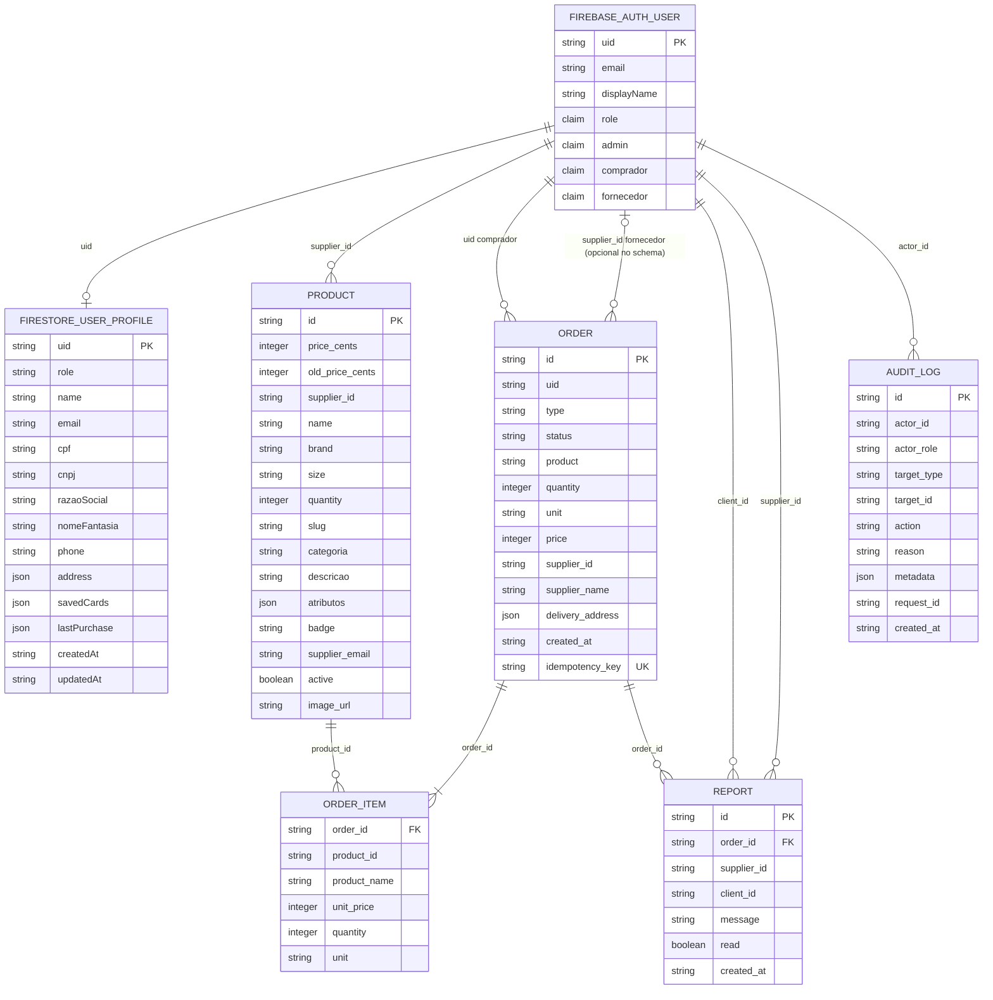

# DER para agentes de codigo - Fraldinha Livre

Este documento descreve o modelo implementado no codigo local, revisado em 2026-09-22, combinando Cloudflare D1, Firebase Auth, Firestore e contratos Zod. Nao comprova migrations aplicadas nem homologacao em producao. Consulte-o seletivamente em tarefas de dados; schemas, migrations, contratos e rotas sao as fontes de implementacao e devem ser reconferidos ao alterar o modelo.

Fontes principais:

- D1/Drizzle: [`back/src/schema`](../../back/src/schema)
- Contratos Zod: [`packages/contracts/src`](../../packages/contracts/src)
- Perfis e auth web: [`front/src/contexts/auth-context.tsx`](../../front/src/contexts/auth-context.tsx)
- Regras Firestore: [`firestore.rules`](../../firestore.rules)
- Visao tabular: [`docs/architecture/database_schema.md`](./database_schema.md)

## Visao ER

As linhas representam relacoes de dominio, sem garantir existencia referencial entre servicos. Somente atributos marcados FK representam foreign keys fisicas do D1. O uid do perfil e a chave do documento users/{uid}, nao um campo obrigatorio do documento. A relacao pedido-itens representa a criacao pela API (ao menos um item); o banco nao impoe esse minimo.

## Fronteiras de dados

O projeto usa duas bases com responsabilidades diferentes.

Firebase Auth e Firestore guardam identidade, claims e perfil do usuario. O documento `users/{uid}` e a representacao editavel do perfil no front. O `uid` do Firebase e a chave logica compartilhada pelo restante do sistema, mas o D1 nao tem uma tabela local de usuarios.

Cloudflare D1 guarda dados transacionais e de catalogo: produtos, pedidos, itens, reportes e auditoria administrativa. As referencias para usuarios aparecem como texto (`uid`, `supplier_id`, `client_id`, `actor_id`; `target_id` apenas quando `target_type = user`) e apontam para o `uid` do Firebase. Essas referencias sao relacionais no dominio, mas nao sao foreign keys fisicas no D1 porque a tabela de usuarios esta no Firebase.

## Entidades e relacoes

### Usuario

Fonte fisica:

- Firebase Auth: identidade, email, display name e custom claims.
- Firestore `users/{uid}`: perfil, papel, dados fiscais, endereco, cartoes salvos e ultima compra.

Papeis esperados:

- `comprador`
- `fornecedor`
- `admin`

Um usuario autenticado pode ainda nao ter perfil Firestore; a relacao e de zero ou um perfil por uid. Claims de autorizacao pertencem ao Firebase Auth e nao sao equivalentes ao campo role editado/criado no perfil.

O contrato publico de provisionamento (`/auth/claim`) permite apenas `comprador` e `fornecedor`. Admin vem de claim/configuracao administrativa, nao de onboarding comum.

### Produto

Tabela D1: `products`.

Cada produto pertence a um fornecedor por `supplier_id`, que e o `uid` do Firebase. Produtos podem ser filtrados por fornecedor no catalogo e no painel do fornecedor.

Campos importantes para agentes:

- `price_cents` e `old_price_cents` estao em centavos.
- `quantity` deve permanecer maior ou igual a zero.
- `atributos` e JSON validado por `ProductAtributosSchema`.
- `active` controla publicacao/visibilidade.

### Pedido

Tabela D1: `orders`.

Cada pedido pertence a um comprador por `uid`. Quando e pedido direto de catalogo, tambem aponta para um fornecedor por `supplier_id`.

Campos importantes para agentes:

- `type` atualmente e `compra-direta` no contrato compartilhado.
- `status` segue `OrderStatusSchema`.
- `delivery_address` e JSON validado por `AddressSchema`.
- `idempotency_key` e unico quando presente, usado para evitar duplicidade de criacao.
- `product`, `quantity`, `unit` e `price` sao resumo do pedido; os itens reais ficam em `order_items`.

### Item do pedido

Tabela D1: `order_items`.

Cada item pertence a um pedido por `order_id`. O `product_id` referencia logicamente `products.id`; a tabela mantem snapshot de `product_name` e `unit_price` para preservar o historico do pedido mesmo que o produto mude depois.

### Reporte

Tabela D1: `reports`.

O fornecedor do pedido cria o reporte para o comprador pela rota POST /orders/:id/report. order_id identifica o pedido; supplier_id recebe o uid do fornecedor autor; client_id recebe orders.uid, o comprador destinatario. O cliente nao e o autor deste fluxo. Fonte: [handler de pedidos](../../back/src/routes/orders.ts).

### Auditoria

Tabela D1: `audit_logs`.

Registra acoes administrativas. O ator (`actor_id`) e um usuario Firebase com `actor_role = admin`. O alvo e polimorfico:

- `target_type = product` aponta para `products.id`
- `target_type = order` aponta para `orders.id`
- `target_type = user` aponta para Firebase `uid`
- `target_type = system` nao exige entidade alvo fisica especifica

Cada evento possui exatamente um par target_type/target_id. Os tipos acima sao alternativas, nao vinculos simultaneos com produto, pedido e usuario; system usa um identificador logico sem entidade fisica obrigatoria. Como target_id e polimorfico, nao ha foreign key fisica no D1 para audit_logs.target_id. O contrato permite esses quatro tipos; a rota administrativa atual grava eventos de moderacao de produto, sem implicar que todos os demais tipos ja tenham fluxos implementados.

## Indices e constraints relevantes

```mermaid
flowchart TD
  orders_uid["idx_orders_uid<br/>orders.uid"]
  reports_order["idx_reports_order_id<br/>reports.order_id"]
  reports_client["idx_reports_client_id<br/>reports.client_id"]
  audit_target["idx_audit_logs_target<br/>audit_logs.target_type + target_id"]
  audit_actor["idx_audit_logs_actor<br/>audit_logs.actor_id"]
  audit_action["idx_audit_logs_action<br/>audit_logs.action"]
  audit_created["idx_audit_logs_created_at<br/>audit_logs.created_at"]
  order_idempotency["orders_idempotency_key_unique<br/>orders.idempotency_key"]
  products_quantity["products_quantity_check<br/>products.quantity >= 0"]
```

## Regras praticas para agentes

- Use `packages/contracts/src` como fonte de formato das payloads HTTP e das respostas consumidas pelo front.
- Use `back/src/schema` como fonte de formato persistido no D1.
- Nao crie tabela D1 de usuarios sem decisao arquitetural: o `uid` Firebase e a chave de usuario atual.
- Nao trate `products.supplier_id`, `orders.uid`, `orders.supplier_id`, `reports.client_id`, `reports.supplier_id` e `audit_logs.actor_id` como foreign keys fisicas; elas sao referencias logicas para Firebase Auth/Firestore.
- Ao alterar `products`, preserve a revalidacao de pedido: o backend deve conferir existencia, preco e fornecedor dos itens antes de gravar `orders` e `order_items`.
- Ao alterar `orders`, mantenha coerencia entre o resumo em `orders` e a lista de itens em `order_items`.
- Ao alterar perfis, preserve a imutabilidade de `role` em updates comuns.
- Ao alterar auditoria, lembre que `audit_logs.target_id` depende de `target_type`; para identificar um alvo especifico, use o par tipo/ID. Filtros amplos apenas por tipo ou acao sao validos; a API tambem aceita targetId isolado, que pode corresponder a IDs iguais em tipos diferentes.

## Lacunas intencionais

O chat do comprador e stateless no backend: as mensagens sao enviadas na requisicao e nao ha tabela de conversas persistida no D1 nesta arquitetura.

Pagamentos ainda nao aparecem como entidade persistida. O checkout usa contratos/adaptadores, mas nao ha tabela `payments` no esquema atual.

Dados de fornecedores exibidos em algumas telas podem vir de mocks ou do perfil Firestore, dependendo do fluxo. Para regra persistente, considere `users/{uid}` como fonte de perfil e `products.supplier_id` como relacao de catalogo.
